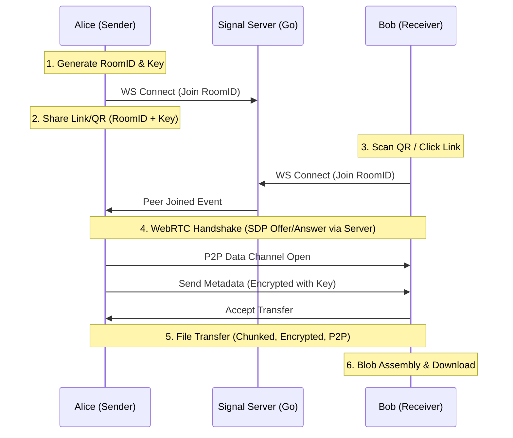

# System Architecture & Implementation Plan

## 1. System Philosophy (The "Coral" Concept)

**CoralSend** is a **Zero-Knowledge, Ephemeral, P2P File Transfer** service.

- **Zero-Knowledge:** The server (Relay/Signaling) never sees the file content or the decryption keys.
- **Ephemeral:** No data is permanently stored on the server.
- **P2P First:** Transfers occur directly between browsers via WebRTC.

## 2. Technical Architecture

### A. High-Level Data Flow




### B. Component Stack

#### 1. Frontend (apps/web)

- **Framework:** Next.js 14+ (App Router)
- **Language:** TypeScript
- **P2P Logic:** `simple-peer` (WebRTC wrapper) or raw `RTCPeerConnection`
- **Crypto:** `Web Crypto API` (Native browser AES-GCM)
- **State:** `Zustand` (for managing connection state)
- **UI:** Tailwind CSS + Radix UI (Minimalist design)
- **PWA:** `next-pwa` (Service Workers, Manifest)

#### 2. Backend (apps/server)

- **Language:** Golang 1.22+
- **Protocol:** WebSocket (using `github.com/gorilla/websocket` or `nhooyr.io/websocket`)
- **Role:** Pure Signaling. No database required for MVP (in-memory room maps).
- **Discovery:** Implements a lightweight room-based messaging system.

## 3. Security Design (Zero-Trust)

- **RoomID:** A random UUIDv4 used to route signaling messages. Known to the server.
- **Shared Key (PSK):** A random string generated on Client A. **Never sent to the server.** It is encoded in the URL hash (`#key=...`) or embedded in the QR code.
- **Encryption:**
- **Signaling:** TLS (HTTPS/WSS).
- **Metadata:** Encrypted with PSK before sending over P2P (even though P2P is encrypted, we add layer 2 security).
- **File Data:** WebRTC uses DTLS/SRTP by default (encryption in transit).

## 4. Implementation Phases (MVP)

### Phase 1: Foundation (Scaffold)

- Set up Monorepo structure (`apps/web`, `apps/server`).
- Configure Docker Compose for local dev.
- Create shared types (if possible via JSON schema or manual sync).

### Phase 2: Signaling Server

- Implement Websocket Handler in Go.
- Create `RoomManager` to handle Join/Leave/Message events.
- Define Signaling Protocol (JSON messages: `offer`, `answer`, `candidate`).

### Phase 3: Frontend P2P Core

- implement `useWebRTC` hook.
- Integrate `qrcode.react` for generating connection codes.
- Implement `html5-qrcode` for scanning.
- Basic UI for "Send" (Create Room) and "Receive" (Join Room).

### Phase 4: File Transfer Logic

- Implement File Chunking (to handle large files without crashing memory).
- Implement Progress Bar logic.
- Add "Download" blob handling.

### Phase 5: Polish & PWA

- Add Service Worker for offline capability (app shell).
- Add "Install App" prompt.
- Mobile responsiveness improvements.

## 5. Directory Structure Target

```text
coralsend/
├── apps/
│   ├── web/                 # Next.js
│   │   ├── src/
│   │   │   ├── components/  # UI Components
│   │   │   ├── hooks/       # useWebRTC, useSignaling
│   │   │   ├── lib/         # crypto.ts, p2p.ts
│   │   │   └── app/         # Pages (Send/Receive)
│   │   └── public/
│   │
│   └── server/              # Golang
│       ├── cmd/server/      # main.go
│       └── internal/
│           ├── signal/      # Hub & Client logic
│           └── protocol/    # Message structs
│
├── deploy/                  # Docker configs
├── Makefile                 # Dev commands
└── README.md


```

