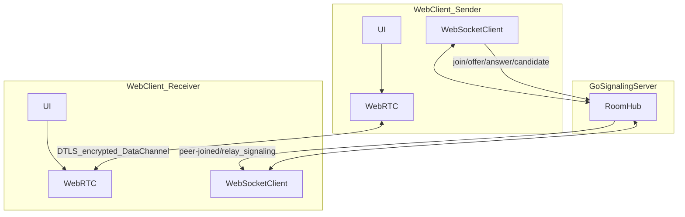
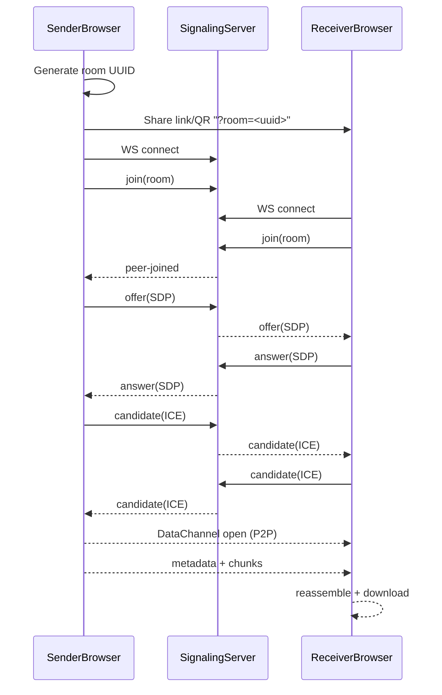

# CoralSend 🪸

CoralSend is a **minimal, P2P-first file transfer** app built with a Next.js PWA frontend and a Go signaling server.

It is designed around two goals:
- **Simple UX**: open → connect → send/receive.
- **Secure-by-default transport**: peer-to-peer transfer over **WebRTC DataChannels** (DTLS encrypted in transit).

## What this repo currently implements (MVP)

- **Room-based pairing** using a UUID `room` value in the URL (QR code + copy/paste link).
- **Signaling server** (WebSocket) that only relays SDP/ICE and a `peer-joined` event.
- **P2P file transfer** over WebRTC DataChannel using chunking + progress UI.
- **No server-side file storage** (server never receives file bytes).

## Important security note (honest status)

WebRTC already encrypts transport (**DTLS**), so file bytes are protected **in transit**.

However, this MVP **does not yet implement application-layer end-to-end encryption (E2EE)** with a user-held key (e.g. AES-GCM with a key in URL fragment `#...`).

That means:
- The server still does **not** store files, but
- The “zero-knowledge keys” design is **planned**, not fully implemented yet.

## Architecture overview

### Components

- `apps/web`: Next.js (App Router) PWA frontend
- `apps/server`: Go WebSocket signaling server

### Communication diagrams

#### 1) High-level architecture



#### 2) Connection sequence (pairing + WebRTC)



### Network ports (dev)

- Web UI: `http://localhost:3000`
- Signaling server (WS): `ws://localhost:8080/ws`
- Health endpoint: `http://localhost:8080/health`

### Connection flow

1. **Sender** creates a room (UUID) and shares a link: `http(s)://<host>:<port>/?room=<uuid>`
2. **Receiver** opens the link (or scans QR) and automatically enters Receive mode.
3. Both clients open a WebSocket to the signaling server and `join` the room.
4. When both clients are present, sender creates an **SDP offer**, receiver answers, both exchange **ICE candidates**.
5. When WebRTC DataChannel opens, clients are considered **connected**.
6. Sender sends **metadata**, then file chunks via DataChannel.
7. Receiver reassembles the file and downloads it.

### Signaling message types

The signaling server relays JSON messages shaped like:

- `join`: join a room
- `peer-joined`: server informs peers that another client is present
- `offer`: SDP offer from sender → receiver
- `answer`: SDP answer from receiver → sender
- `candidate`: ICE candidates both ways

## Trust model / Threat model (MVP)

### What the server can and cannot see

- **Can see**: room IDs, connection timing, IP/metadata at the network layer (standard server logs), signaling payloads (SDP/ICE).
- **Cannot see**: file bytes (file never goes through the server).

### What you must treat as secret right now

- The **room link** is the secret. Anyone with the `?room=<uuid>` link can join (MVP has no auth/approval yet).

### Known limitations / risks in current MVP

- **No E2EE layer** (beyond WebRTC’s transport encryption).
- **No explicit “accept/reject connection” handshake** at the app layer (room link implies permission).
- **No TURN server configured**. Some NAT/firewall setups may prevent P2P from connecting reliably.
- **No persistence**: if tabs close, transfers stop (by design for now).

## Development

### Prerequisites

- Go 1.24+
- Node.js 20+
- (Optional) Docker & Docker Compose

### Environment Variables

CoralSend supports configuration via environment variables. Copy `.env.example` to `.env` and configure:

```bash
cp .env.example .env
```

**Key variables:**

- `NEXT_PUBLIC_BASE_PATH`: Base path for subdirectory deployment (e.g., `/coralsend`). Leave empty for root deployment.
- `NEXT_PUBLIC_SIGNALING_URL`: WebSocket signaling server URL (e.g., `wss://yourdomain.com/ws`). If not set, auto-detected from current URL.

**Example for subdirectory deployment:**
```bash
NEXT_PUBLIC_BASE_PATH=/coralsend
NEXT_PUBLIC_SIGNALING_URL=wss://612.ir/ws
```

**Example for root deployment:**
```bash
# Leave NEXT_PUBLIC_BASE_PATH empty or unset
NEXT_PUBLIC_SIGNALING_URL=wss://612.ir/ws
```

**Note:** For Docker builds, these variables must be passed as build args (see `deploy/docker-compose.yml`).

### Run locally

Run both services:

```bash
make dev
```

Or run manually:

Backend:

```bash
cd apps/server
go run cmd/server/main.go
```

Frontend:

```bash
cd apps/web
npm run dev
```

### Test on your phone (same Wi‑Fi)

To test from a mobile device, your Next.js dev server must listen on all interfaces:

```bash
cd apps/web
npm run dev -- -H 0.0.0.0
```

Then open from your phone:

- `http://<your-laptop-ip>:3000`

The app will automatically compute the WebSocket URL for signaling using your current hostname (e.g. `ws://<your-laptop-ip>:8080/ws`).

## Operational checklist (for confidence)

### Functional checks

- Sender shows a QR and “Waiting for peer…”
- Receiver opens link and shows “Connecting…”
- Console logs show: `peer-joined` → `offer` → `answer` → `candidate`
- DataChannel opens and UI switches to “Connected”
- File transfer progress reaches 100% and receiver downloads the file

### Security checks (MVP reality)

- Ensure the signaling server is reachable only as intended (dev LAN vs public).
- Treat room links as sensitive until E2EE + user-approval handshake is added.
- Prefer HTTPS/WSS in production (terminate TLS at a reverse proxy).

## Roadmap (recommended next steps)

- **Add E2EE with a key in URL fragment** (`#key=...`) + AES-GCM chunk encryption in the browser.
- **Add “pairing confirmation”** (receiver requests; sender approves) to prevent unwanted joins.
- **Add TURN support** for reliable connections in restrictive networks.
- **Add expiry policies** and optional “store-and-forward” fallback for async delivery.

