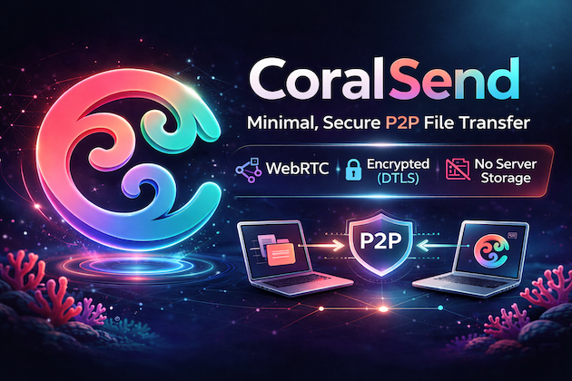
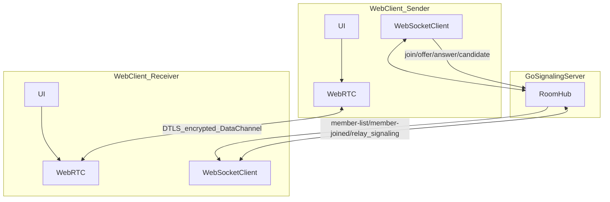
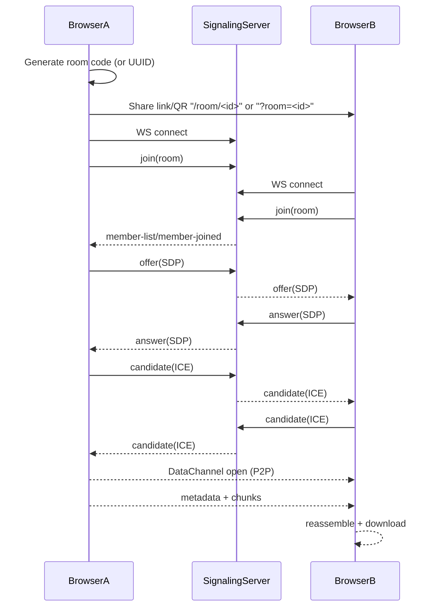

# CoralSend 🪸

> 🚧 **Development Status**
>
> CoralSend is currently under active development and should be considered **experimental**.
>
> This repository represents an MVP and is **not production-ready** yet.
> APIs, security assumptions, and internal architecture may change without notice.
>
> **Do not use in production environments** until a stable release is explicitly announced.


CoralSend is a **minimal, P2P-first file transfer** app built with a Next.js PWA frontend and a Go signaling server.



It is designed around two goals:
- **Simple UX**: open → connect → send/receive.
- **Secure-by-default transport**: peer-to-peer transfer over **WebRTC DataChannels** (DTLS encrypted in transit).

## What this repo currently implements (MVP)

- **Room-based joining** with either a short room code (6 chars) or UUID (`/room/<id>` or `?room=<id>`).
- **Multi-peer room presence** (`member-list`, `member-joined`, `member-left`) over WebSocket signaling.
- **P2P file transfer** over WebRTC DataChannel using chunking + progress UI.
- **PWA share target flow** to receive files from other apps into CoralSend.
- **No server-side file storage** (server never receives file bytes).

## Important security note (honest status)

WebRTC already encrypts transport (**DTLS**), so file bytes are protected **in transit**.

However, this MVP **does not yet implement application-layer end-to-end encryption (E2EE)** with a user-held key (e.g. AES-GCM with a key in URL fragment `#...`).

That means:
- The server still does **not** store files, but
- The “zero-knowledge keys” design is **planned**, not fully implemented yet.

## Licensing

CoralSend uses a split licensing model:

- Community code license: **AGPL-3.0-only** (`LICENSE`)
- Commercial self-host terms: `COMMERCIAL_LICENSE.md`
- Trademark/brand usage policy: `TRADEMARKS.md`
- Plain-language licensing guide: `docs/legal/licensing.md`

## Architecture overview

### Components

- `apps/web`: Next.js (App Router) PWA frontend
- `apps/server`: Go WebSocket signaling server

### Communication diagrams

#### 1) High-level architecture



#### 2) Connection sequence (pairing + WebRTC)



### Network ports (dev)

- Web UI: `http://localhost:3000`
- Signaling server (WS): `ws://localhost:8080/ws`
- Health endpoint: `http://localhost:8080/health`

### Connection flow

1. A user creates a room code and shares a link: `http(s)://<host>:<port>/room/<id>` (or `?room=<id>`).
2. Other users join via QR, pasted link, room code, or browser share-target flow.
3. Clients open a WebSocket to signaling and send `join`.
4. Server synchronizes room membership via `member-list` and `member-joined`.
5. Peers exchange **SDP offer/answer** and **ICE candidates** (directed by `targetId`).
6. When each WebRTC DataChannel opens, peers are considered connected.
7. File metadata is announced (`file-meta`), receivers request files (`file-request`), then chunks flow over DataChannel.

### Signaling message types

The signaling server relays JSON messages shaped like:

- `join`: join a room with device metadata
- `member-list`: current room members (presence snapshot)
- `member-joined`: notify others about a newly joined member
- `member-left`: notify remaining members when someone disconnects
- `offer`: SDP offer (targeted to a peer)
- `answer`: SDP answer (targeted to a peer)
- `candidate`: ICE candidates (targeted to a peer)
- `file-meta`: announce available file metadata
- `file-request`: request file transfer from uploader
- `chat`: room text chat payload relay

## Trust model / Threat model (MVP)

### What the server can and cannot see

- **Can see**: room IDs, connection timing, IP/metadata at the network layer (standard server logs), signaling payloads (SDP/ICE).
- **Cannot see**: file bytes (file never goes through the server).

### What you must treat as secret right now

- The **room link** is the secret. Anyone with the `?room=<uuid>` link can join (MVP has no auth/approval yet).

### Known limitations / risks in current MVP

- **No E2EE layer** (beyond WebRTC’s transport encryption).
- **No explicit “accept/reject connection” handshake** at the app layer (room link implies permission).
- **TURN is optional and must be configured correctly in production**. If TURN env vars are missing/invalid, some NAT/firewall setups may fail.
- **No persistence**: if tabs close, transfers stop (by design for now).

## Development

### Prerequisites

- Go 1.24+
- Node.js 20+
- (Optional) Docker & Docker Compose

### Environment variables

CoralSend supports configuration via environment variables. Copy `.env.example` to `.env` and configure:

```bash
cp .env.example .env
```

**Key variables:**

- `NEXT_PUBLIC_BASE_PATH`: Base path for subdirectory deployment (e.g., `/coralsend`). Leave empty for root deployment.
- `NEXT_PUBLIC_SITE_URL`: Public site origin used for canonical metadata, sitemap, robots, and `llms.txt` URLs.
- `NEXT_PUBLIC_APP_VERSION`: App version shown in UI (falls back to `apps/web/package.json` if unset).
- `NEXT_PUBLIC_SIGNALING_URL`: WebSocket signaling server URL (e.g., `wss://yourdomain.com/ws`). If not set, auto-detected from current URL.
- `NEXT_PUBLIC_STUN_URL`: STUN server URL for ICE gathering.
- `NEXT_PUBLIC_TURN_URL`, `NEXT_PUBLIC_TURN_USER`, `NEXT_PUBLIC_TURN_PASS`: TURN relay configuration.
- `NEXT_PUBLIC_ICE_DIAGNOSTICS`: Enables additional ICE path/error logs in browser console when set to `true`.
- `NEXT_PUBLIC_GITHUB_URL` (+ optional social URLs): Used for footer/changelog social links.
- `APP_ENV`: Runtime mode for signaling hardening (`production` enables strict origin checks).
- `ALLOWED_ORIGINS`: Comma-separated origin allowlist for signaling HTTP CORS and WebSocket origin validation.
- `RATE_LIMIT_WINDOW`, `RATE_LIMIT_MAX_REQUESTS`: Basic per-IP fixed-window signaling rate limits on `/ws`.

**Example for subdirectory deployment:**
```bash
NEXT_PUBLIC_BASE_PATH=/coralsend
NEXT_PUBLIC_SIGNALING_URL=wss://612.ir/ws
```

**Example for root deployment:**
```bash
# Leave NEXT_PUBLIC_BASE_PATH empty or unset
NEXT_PUBLIC_SIGNALING_URL=wss://612.ir/ws
```

**Note:** For Docker builds, these variables must be passed as build args (see `deploy/docker-compose.yml`).

### Run locally

Run both services:

```bash
make dev
```

Or run manually:

Backend:

```bash
cd apps/server
go run cmd/server/main.go
```

Frontend:

```bash
cd apps/web
npm run dev
```

### Test on your phone (same Wi‑Fi)

To test from a mobile device, your Next.js dev server must listen on all interfaces:

```bash
cd apps/web
npm run dev -- -H 0.0.0.0
```

Then open from your phone:

- landing page: `http://<your-laptop-ip>:3000`
- app home: `http://<your-laptop-ip>:3000/app`

The app will automatically compute the WebSocket URL for signaling using your current hostname (e.g. `ws://<your-laptop-ip>:8080/ws`).

## Production installation on a VPS (Docker Compose)

This section describes a complete self-hosted deployment with:
- `web` (Next.js app)
- `server` (Go signaling)
- `nginx` (reverse proxy)
- `coturn` (self-hosted STUN/TURN)

### 1) Prerequisites on the server

- Ubuntu/Debian VPS with a public IP
- Docker + Docker Compose plugin installed
- DNS records pointing to the VPS (recommended):
  - `app.example.com` (web + ws through nginx)
  - `turn.example.com` (TURN endpoint)
- Open firewall ports:
  - `80/tcp` (HTTP)
  - `443/tcp` (HTTPS, when TLS is enabled)
  - `3478/tcp` and `3478/udp` (TURN)
  - `49160-49200/tcp` and `49160-49200/udp` (TURN relay range)

### 2) Clone and configure environment

```bash
git clone https://github.com/<owner>/coralsend.git
cd coralsend
cp .env.example .env
```

Edit `.env`:

- `NEXT_PUBLIC_SIGNALING_URL=wss://app.example.com/ws`
- `NEXT_PUBLIC_BASE_PATH=` for root deployment, or `/coralsend` for subdirectory deployment
- `NEXT_PUBLIC_STUN_URL=stun:turn.example.com:3478`
- `NEXT_PUBLIC_TURN_URL=turn:turn.example.com:3478?transport=udp`
- `NEXT_PUBLIC_TURN_USER` / `NEXT_PUBLIC_TURN_PASS`
- `TURN_REALM=turn.example.com`
- `TURN_USER` / `TURN_PASSWORD`
- `TURN_EXTERNAL_IP=<your_vps_public_ip>`
- `SERVER_IMAGE` and `WEB_IMAGE` (GHCR tags, if you deploy prebuilt images)

### 3) Deploy using Docker Compose

From repository root:

```bash
docker compose --env-file .env -f deploy/docker-compose.prod.yml up -d --build
```

If you want image-only deploy (no local build), set `SERVER_IMAGE` and `WEB_IMAGE` to existing GHCR tags and run:

```bash
docker compose --env-file .env -f deploy/docker-compose.prod.yml up -d
```

### 4) Validate services

```bash
docker compose -f deploy/docker-compose.prod.yml ps
docker compose -f deploy/docker-compose.prod.yml logs -f server
curl -fsS http://127.0.0.1:8080/health
```

Expected behavior:
- `server` becomes healthy
- `nginx` serves the app on port 80
- WebSocket upgrade path `/ws` is proxied to `server:8080`
- `coturn` listens on `3478` and relay ports

### 5) TLS / WSS (required for real production)

- Use a TLS terminator (nginx + certbot or your existing ingress)
- Once TLS is enabled, keep:
  - `NEXT_PUBLIC_SIGNALING_URL=wss://app.example.com/ws`
  - TURN as `turn:...` or `turns:...` depending on your TLS strategy for TURN

### 6) Subdirectory deployment notes (`NEXT_PUBLIC_BASE_PATH`)

- If app is behind `/coralsend`, set:
  - `NEXT_PUBLIC_BASE_PATH=/coralsend`
- Ensure reverse proxy routes that path to `web:3000`.
- `NEXT_PUBLIC_SIGNALING_URL` should still point to `/ws` on the same external domain (or a dedicated WS domain).

## Runtime behavior (step-by-step)

1. User A opens the app and creates a room.
2. User B joins via URL/QR.
3. Both clients connect to signaling over WebSocket (`/ws`) and exchange SDP/ICE.
4. Browser ICE gathers candidates from:
   - configured STUN (`NEXT_PUBLIC_STUN_URL`)
   - configured TURN (`NEXT_PUBLIC_TURN_URL`, credentials)
5. If direct P2P is blocked, TURN relay is used.
6. DataChannel opens and file chunks flow browser-to-browser.
7. Server and TURN do not store files; they facilitate connectivity/signaling only.

## CI/CD: Build and publish Docker images to GHCR

This repository includes a GitHub Actions workflow at `.github/workflows/docker.yml` that:
- Builds `deploy/Dockerfile.server` and `deploy/Dockerfile.web`
- Publishes to GHCR:
  - `ghcr.io/<owner>/coralsend-server`
  - `ghcr.io/<owner>/coralsend-web`
- Tags images with branch, semver tags, and commit SHA

### Required repository settings

- Repository visibility/settings must allow publishing packages to GHCR
- `GITHUB_TOKEN` package write is enabled (workflow sets `packages: write`)

### Release flow

1. Push to `main` -> workflow builds and publishes `:main` and SHA tags.
2. Create a git tag like `v1.2.0` -> workflow also publishes semver tags.
3. Set `SERVER_IMAGE` / `WEB_IMAGE` in `.env` to selected tags and redeploy compose.

## Operational checklist (for confidence)

### Functional checks

- Creator can generate a room and share `/room/<id>` (or copy/paste equivalent).
- Joiner opens link or scans QR and shows connecting status.
- Console logs show presence + signaling flow: `member-list/member-joined` → `offer` → `answer` → `candidate`.
- DataChannel opens and members show online/connected.
- File transfer progress reaches 100% and receiver downloads the file.

### Security checks (MVP reality)

- Ensure the signaling server is reachable only as intended (dev LAN vs public).
- Treat room links as sensitive until E2EE + user-approval handshake is added.
- Prefer HTTPS/WSS in production (terminate TLS at a reverse proxy).

## Roadmap (recommended next steps)

- **Add E2EE with a key in URL fragment** (`#key=...`) + AES-GCM chunk encryption in the browser.
- **Add “pairing confirmation”** (receiver requests; sender approves) to prevent unwanted joins.
- **Harden TURN for production** (TLS TURN, long-term creds rotation, metrics/alerts).
- **Add expiry policies** and optional “store-and-forward” fallback for async delivery.

