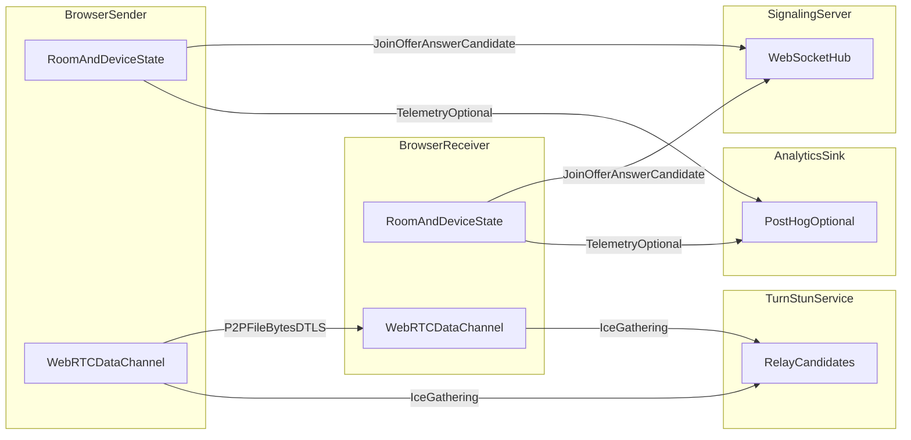

# CoralSend Data Flow

## System Boundary

CoralSend consists of:

- Web client (`apps/web`) running in user browsers.
- Signaling server (`apps/server`) over WebSocket.
- TURN/STUN service for WebRTC connectivity.
- Optional analytics sink (PostHog) from client events.

File bytes are transferred peer-to-peer over WebRTC DataChannel; signaling server does not store file payload bytes.

## Data Classes

| Data Class | Examples | Primary Path | Sensitivity | Retention |
| --- | --- | --- | --- | --- |
| Room/session metadata | `roomId`, join/leave events | Browser <-> Signaling | Confidential | Ephemeral in memory; server logs may retain event text. |
| Device identifier | Generated `deviceId` | Browser local storage + signaling payloads | Confidential | Browser-persistent until reset by user. |
| WebRTC signaling data | SDP offers/answers, ICE candidates | Browser <-> Signaling | Confidential | Ephemeral transit; may appear in server logs if debug logging enabled. |
| File metadata | Name, size, MIME type, uploader display name | Browser <-> Browser via signaling + data channel control messages | Confidential | Ephemeral in room state/history on client. |
| File content bytes | Arbitrary file data | Browser <-> Browser (WebRTC) | Confidential | Not stored server-side by design. |
| Analytics events | Page view, usage telemetry, pseudonymous id | Browser -> PostHog | Confidential | Per analytics provider retention settings. |

## Data Flow Diagram

## Trust Boundaries

- Browser <-> Signaling boundary: server receives room and signaling metadata.
- Browser <-> TURN boundary: relay can observe transport metadata.
- Browser <-> Analytics boundary: optional third-party telemetry transfer.
- Peer-to-peer boundary: file bytes flow directly between peers once channel opens.

## Retention Notes

- Server-side retention should remain minimal.
- If logs are enabled, avoid logging raw payloads containing unnecessary metadata.
- Analytics retention should be explicitly configured and disclosed in privacy policy.

## Assumptions and Limits

- This model reflects current MVP behavior documented in repository README.
- Application-layer E2EE for payload encryption keys is planned and not fully implemented in the current MVP.
- Formal data lineage tooling is out-of-scope for this baseline.
